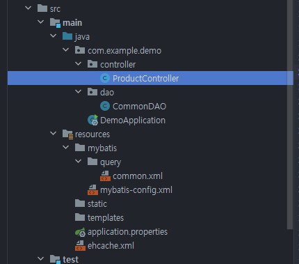

# EHCache Test (Min siwan)
**-NAME: Min siwan**  
**-Due date: 2020-09-21**  
**-Tools: IntelliJ, Spring boot, Mybatis etc**  
## EHCache
캐시 엔진 중의 하나이다. 주요 특징으로는 아래와 같다.  
 + 경량의 빠른 캐시 엔진  
 + 확장성: 메모리, 디스크 저장 지원, 멀티 CPU의 동시 접근에 튜닝  
 + 높은 품질
## Flow
  
  

## Directory 
 

## Query
 **like concat** 문법을 활용하여 **pcode**에 입력된 값이 포함되는 상품을 모두 출력하도록 설정.  
   
 

## Test

**userid**: dabagirl   
**pcode**: 15 ("15"가 포함된 상품 모두 출력)   

## Result
### Result page 

## Tiem check

## Error 내용
*  **@EnableCaching**를 적용하면 compile 에러 현상이 나타납니다. (해결)  
    - **build.gradle** Source 변경 